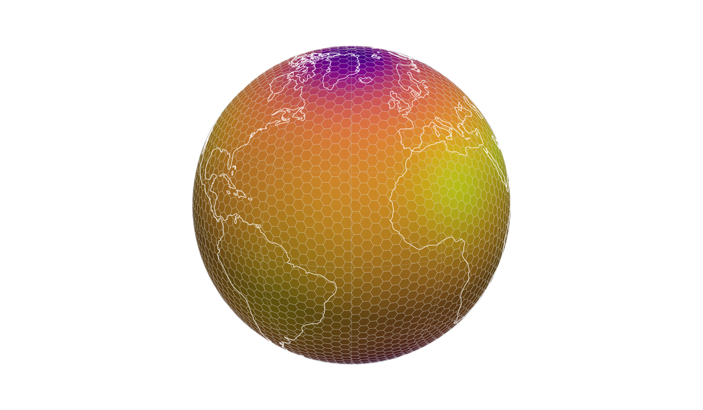

<p align="center">
  
</p>

# IcoScope

Interactive 3D viewer for icosahedral hexagonal/pentagonal grids on a sphere —
the kind produced by the **DYNAMICO** dynamical core (used standalone or
coupled with LMDZ physics as **ICOLMDZ**).

Loads a DYNAMICO/ICOLMDZ NetCDF output (or generates a synthetic grid for
sanity checks), and lets you pick cells, overlay coastlines and a graticule,
switch colormaps and themes, scrub through time, and export PNG or SVG.

## Install

The recommended way is **`pipx`**, which installs IcoScope and its dependencies
into a private virtualenv without touching your main Python environment:

```bash
pipx install git+https://github.com/ArrialVictor/IcoScope
icoscope
```

If you don't have `pipx`:

```bash
python -m pip install --user pipx
python -m pipx ensurepath
```

Alternatively, inside any environment of your choice:

```bash
pip install git+https://github.com/ArrialVictor/IcoScope
```

## Upgrade

When a new release is out, re-run the same install command with an upgrade flag.

With `pipx`:

```bash
pipx upgrade icoscope
```

With `pip`:

```bash
pip install --upgrade git+https://github.com/ArrialVictor/IcoScope
```

## Uninstall

With `pipx`:

```bash
pipx uninstall icoscope
```

With `pip`:

```bash
pip uninstall icoscope
```

## Use

```bash
icoscope                               # open the viewer with a synthetic grid
icoscope -n 60                         # finer synthetic grid
icoscope --file output.nc              # load a DYNAMICO/ICOLMDZ NetCDF
icoscope --file output.nc --describe   # print the file's schema, no GUI
```

Once the viewer is open, fields, coastlines, time slider, themes, etc. are all
controlled from the side panel.

### Synthetic zoom (Schmidt)

The synthetic grid supports DYNAMICO's Schmidt-style conformal zoom — useful
for previewing how a stretched mesh would look without needing a real file.

```bash
icoscope --zoom-factor 3 --zoom-lon 2 --zoom-lat 48   # zoom on Paris
```

`--zoom-factor 1.0` (the default) is the identity. Values above 1 concentrate
cells at the focal point and coarsen the antipode; values below 1 do the
opposite. The implementation mirrors DYNAMICO's `schmidt_transform` (Guo &
Drake, *JCP* 2005, eq. 12). You can also adjust the same parameters live
from the "Synthetic zoom (Schmidt)" group in the side panel.

> ℹ️ **The very first launch after install can take 10–15 seconds** while
> Python compiles every dependency's bytecode and the OS loads VTK's large
> binary libraries from disk for the first time. Subsequent launches reuse
> the cache and start in a couple of seconds. Progress messages print to the
> terminal as it works; pass `--quiet` to silence them.

## NetCDF schema

IcoScope expects the CF-convention "bounds" layout:

```
lon(cell)                ; bounds = "bounds_lon"
lat(cell)                ; bounds = "bounds_lat"
bounds_lon(cell, nvertex)
bounds_lat(cell, nvertex)
<field>(cell)            or  <field>(time, cell)
```

Common variable-name variants are auto-detected (`lon`/`longitude`/`clon`,
etc.). Pentagons should pad the last `nvertex` slot with a repeated vertex.

If your file uses a different layout, run `icoscope --file <path> --describe`
and adapt the auto-detect lists in `src/icoscope/loader.py`.

## License

MIT — see [LICENSE](LICENSE).
